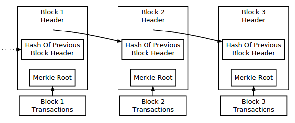
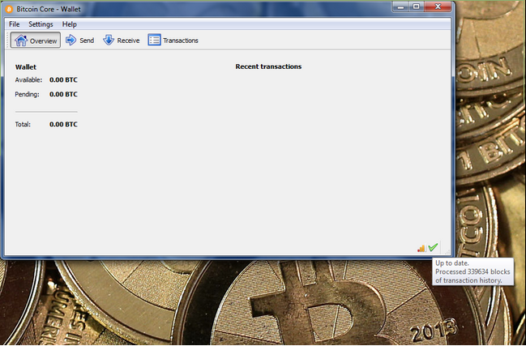
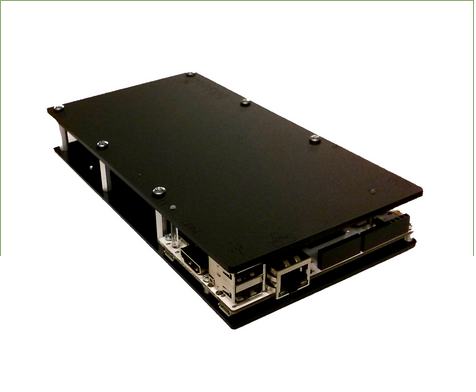

# Chapter 1: The Blockchain

## Background

The most important and fundamental tool of a bank is a ledger, a written record of transactions and balances for each account held at the bank. Without this ledger, it would be difficult if not impossible to keep track of the ownership of assets and liabilities of both the bank's customers and the bank itself. Similarly, a ledger is also fundamental to bitcoin. This ledger is called a “blockchain” and stores a complete record of every transaction that has been accepted by the bitcoin network since the launch of the “genesis block” at the beginning of bitcoin's existence. The blockchain is stored and maintained by bitcoin “full nodes,” which are required for broadcasting and relaying transactions on the bitcoin network.

  
Simplified bitcoin blockchain.[5](chapter_1_the_blockchain.md#fn_5)

While the legacy banking system relies on “correspondents” and other intermediaries to move funds between banks when there is no direct connection, bitcoin instead relies on a system of peer-to-peer connections between full nodes to relay transactions to miners, and then relay blocks from miners back to the rest of the bitcoin network. After a block has been accepted as valid by a majority of nodes on the network, it will be added to the blockchain, and miners will then begin building the next block with the latest batch of transactions. New entrants to the bitcoin network will only accept the longest blockchain as valid, making it very difficult for someone to trick new nodes into downloading an inaccurate blockchain. More information on the process of building blocks and adding them to the blockchain is included in Chapter 2.

## Bitcoin Core 

The easiest way to run a full node and maintain your own copy of the blockchain is to download and run Bitcoin Core.  This software will connect to peers in the bitcoin network and begin downloading and verifying blocks from each of them, eventually assembling a full copy of the bitcoin blockchain. As of the time of writing this First Edition, the full bitcoin blockchain is just over 37 gigabytes in size.

  
Bitcoin Core full node.

If your router has Universal Plug and Play capabilities, or you manually open port 8333, then Bitcoin Core will also accept and validate new transactions and blocks from other full nodes, then relay these transactions and blocks to other full nodes. This process is what keeps the bitcoin network running, making full nodes essential to the success of bitcoin.

## Bitseed

The process of running a full node takes up a lot of a computer's resources, including processing power and storage space, making it impractical to run on a laptop or even some desktop computers. To make running a full node more convenient for people who want to support the bitcoin network but would prefer to save their personal computer's resources for other purposes e.g. web browsing, document editing, media storage, etc, a company called Bitseed has created a “plug and play” bitcoin full node device which simply needs to be plugged into power and an Internet-connected router before it begins downloading a local copy of the bitcoin blockchain.

  
Bitseed bitcoin full node.

As with running Bitcoin Core on your personal computer, to ensure that your Bitseed full node is supporting the bitcoin network and not simply downloading new blocks, you either need to have a router that supports Universal Plug and Play or you need to manually open port 8333.

Once you have downloaded a full copy of the bitcoin blockchain, you have taken your first step towards using bitcoin to be your own bank.

 [https://bitcoin.org/en/developer-guide\#block-chain](https://bitcoin.org/en/developer-guide#block-chain)  
 [https://bitcoin.org/en/download](https://bitcoin.org/en/download)  
 [https://bitcoin.org/en/full-node](https://bitcoin.org/en/full-node)  
 Instructions for opening a port vary depending on routers, so you will need to consult your router's manual or contact your ISP for instructions for opening port 8333.  
 [https://bitseed.org/shop/](https://bitseed.org/shop/) Full disclosure: I am a co-founder of Bitseed.

