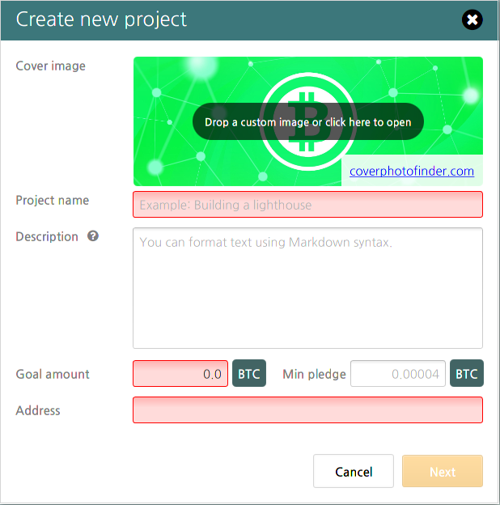

# Chapter 3: Financing with Bitcoin

##Background  
Two valuable services that banks provide in addition to storing their customers money is the lending of that money to creditworthy borrowers and the financing of businesses via investment capital. Bitcoin enables users similar functionality by both providing a payment network that allows people to directly send and receive funds for a loan i.e. peer-to-peer lending, and also providing a mechanism through which people can raise money for a project provided a minimum threshold of funds have been committed i.e. crowdfunding. Peer-to-peer financing is possible using the basic “send” and “receive” features of bitcoin as described in the previous chapter, provided the recipient of the loan also has a bitcoin account. Crowdfinance, or using a group of people to finance a project rather than just one financier, is also possible with bitcoin. Crowdfinance through crowdfunding and crowdlending with bitcoin is possible using the same programmatic capability that multisignature accounts take advantage of, a feature in bitcoin known as “scripts,” sometimes referred to as “contracts” or “smart contracts.”[^22] The specific contract used for crowdfunding and crowdlending with bitcoin is referred to as either an “assurance contract” or “dominant assurance contract,” depending on which is implemented.[^23]  

##Lighthouse  
In July 2014, it was announced that Bitcoin developer Mike Hearn won part of a $100,000 bounty offered by entrepreneur and investor Olivier Janssens to create an app that would “replace the Bitcoin Foundation.”[^24] This app is called “Lighthouse” and it enables people to crowdfinance projects by creating a transaction that is only released to the receiving address after the balance has reached a certain threshold.[^25] The transaction details are shared with potential funders of the transaction, who then send bitcoin to the receiving address. After the receiving address reaches the threshold balance, the transaction completes and the recipient receives the pledged bitcoin. This replicates the functionality of a traditional crowdfinance platform without the need for a third party to hold the funds in escrow until all pledges are collected.  

To raise bitcoin for a project using Lighthouse, download the program from vinumeris.com/lighthouse, run the program, and wait for the client to sync with the bitcoin network. After the client is fully synced, click “Create Project.” You will then be presented with this form:  

<i>Creating a project with Lighthouse.  

After filling out the form, click “Next.” You will then be presented with these options:
 

<i>Hosted vs Decentralized Crowdfinancing.  

You can choose to either host your Lighthouse project on a centralized server, which makes it easier for people to find and interact with, or you can choose to go fully decentralized, where you distribute the project file to potential supporters yourself, collecting and importing returned pledge files manually.

After potential supporters have imported the project file, they will be shown a screen like this:

  
<i>BYOB project on Lighthouse.  

To make a pledge, supporters need to first add bitcoin to their Lighthouse wallet. They can then click the “Pledge” button and pledge up to the amount of bitcoin they have in their wallet (minus the transaction fee). Supporters can take back their pledge at any time without needing to contact the project creator. When the project reaches its fundraising goal, the transaction completes and the project creator (or mediator, if one was used) will receive all of the pledged bitcoin. If the project uses crowdfunding, the bitcoin will usually not need to be paid back to contributors unless there is a prior agreement stating otherwise. If the project uses crowdlending, then the borrower can pay back the bitcoin plus any interest simply by sending the correct amount back to the same address that made the original pledge. Care will need to be taken by the lender to either maintain control over the private key for the sending address between the time the loan is made and the time it is paid back, or to include with their transaction a message either embedded in the blockchain or sent directly to the borrower indicating a better long-term address for the loan repayment to be sent to. Remember, bitcoin sent to an address for which private keys are lost or compromised will most likely be lost forever, so protect, backup, and keep track of all of your private keys.  

[^22] Contracts. (2015, January 10). Retrieved February 26, 2015, from https://en.bitcoin.it/wiki/Contracts  
[^23] Simpson, A. (2014, April 28). Game Theory, Assurance Contract and Crowdfunding via Bitcoin. Retrieved February 26, 2015, from http://www.ariannasimpson.com/game-theory-assurance-contracts/  
[^24] Janssens, O. (2014, July 2). $100,000 bounty winner announcement! Retrieved February 26, 2015, from https://www.reddit.com/r/Bitcoin/comments/29n8o0/100000_bounty_winner_announcement/?sort=top  
[^25] Hearn, M. (2015, January 20). Lighthouse Beta. Retrieved February 26, 2015, from http://blog.vinumeris.com/2015/01/20/lighthouse-beta/  